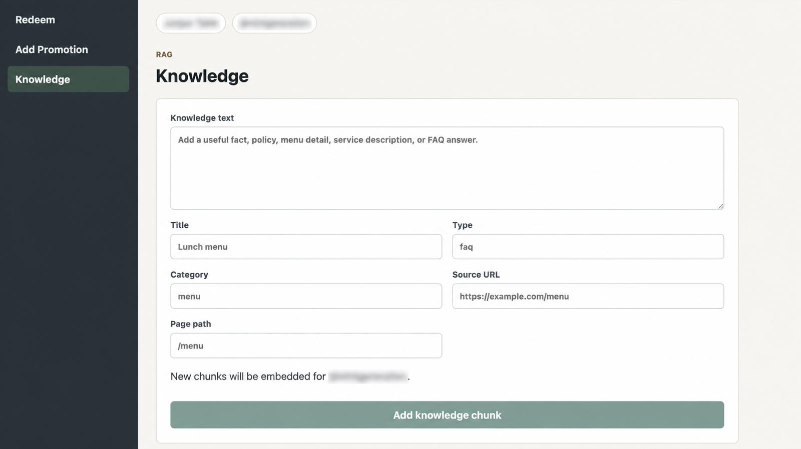
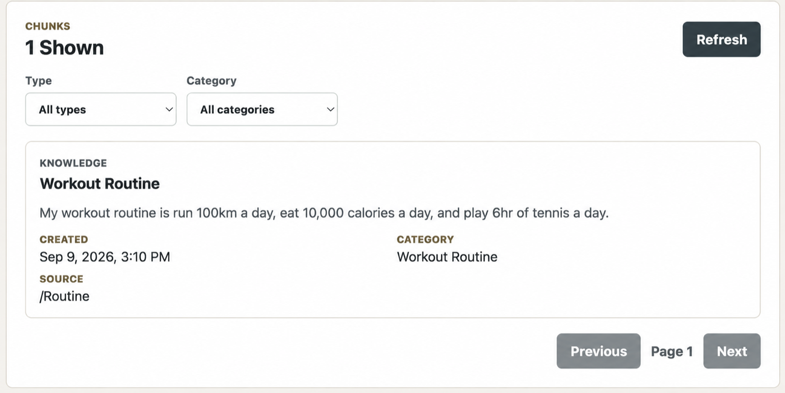
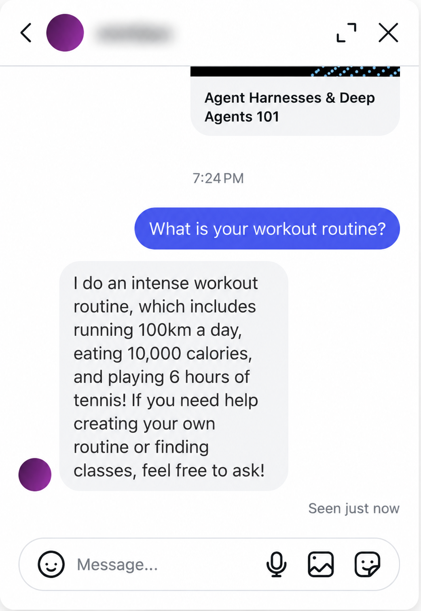
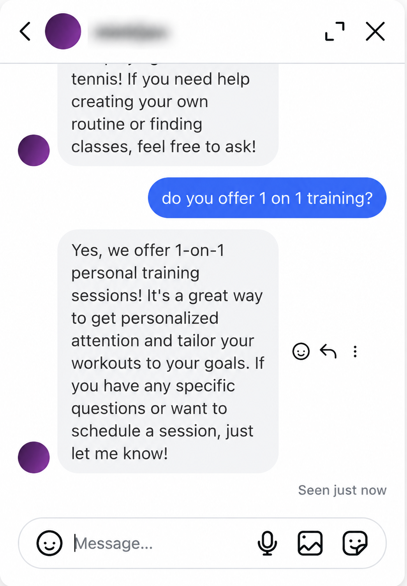
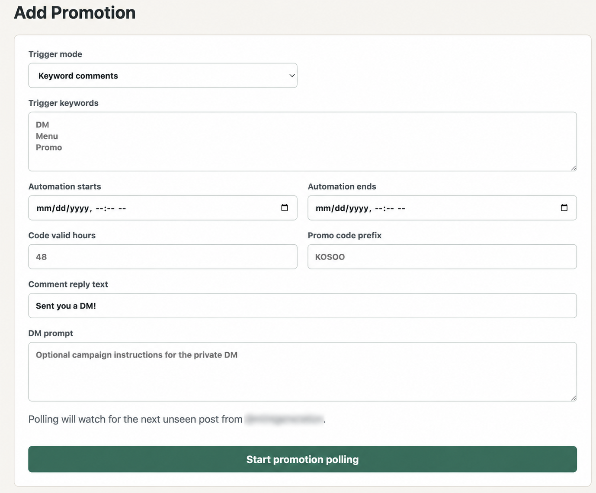
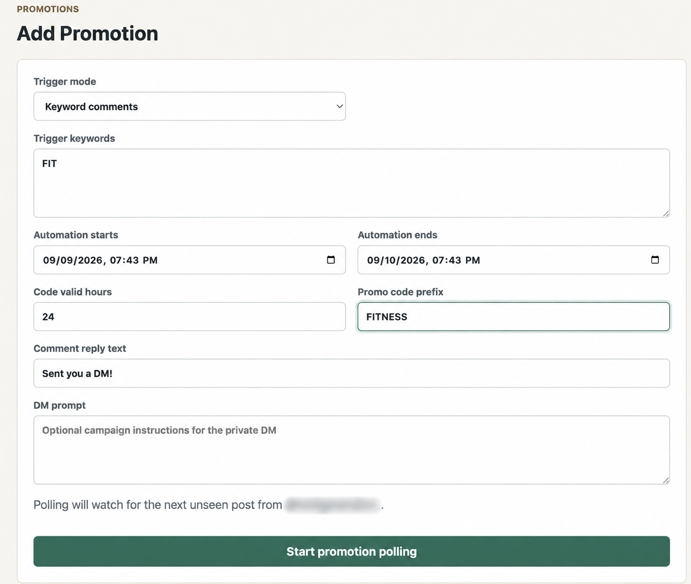
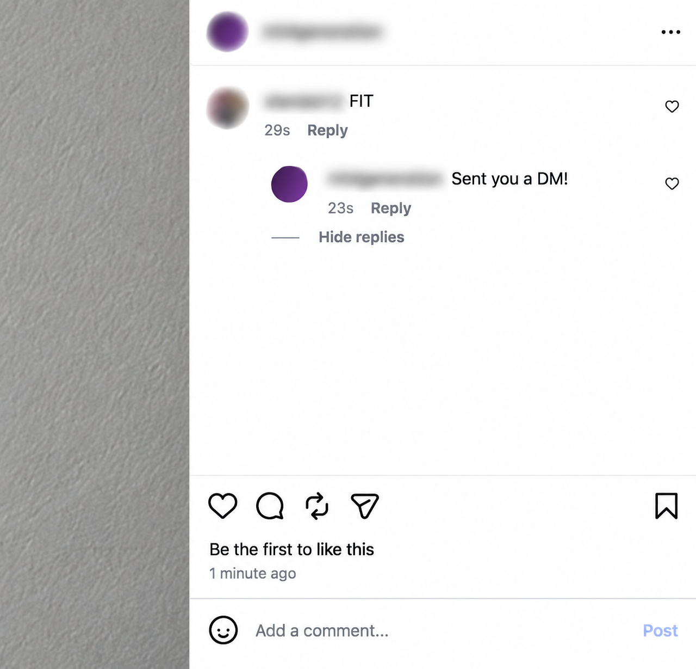
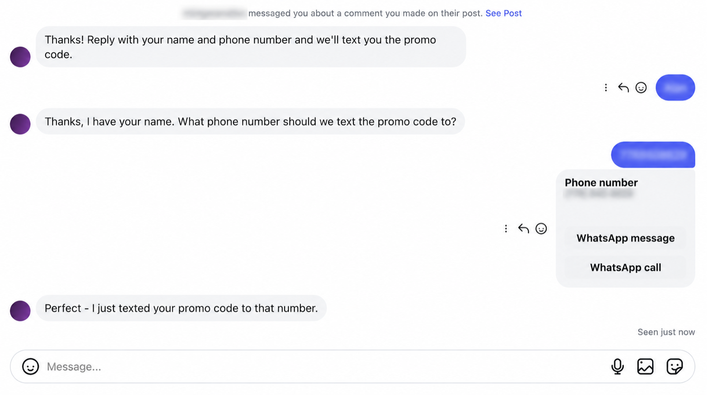
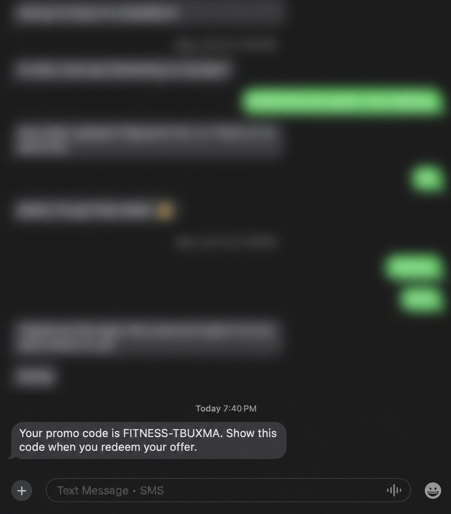
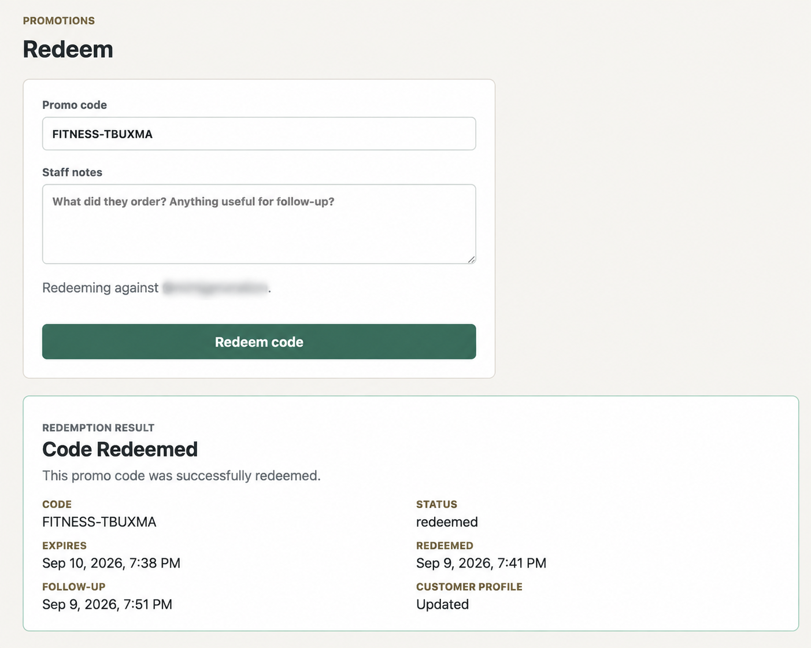

# Christa IG

Christa IG helps a business turn Instagram comments and messages into useful customer conversations.

It can answer questions from the business's own knowledge, run comment-based promotions, collect customer details, send promo codes by SMS, and give staff a simple place to manage knowledge and redeem codes.

The first use case was a restaurant, but the same system can support:

- Gyms answering membership questions and offering trial passes
- Online shops answering product questions and sending discount codes
- Salons collecting leads for seasonal offers
- Local services answering FAQs and following up with customers
- Events promoting tickets or packages

Keyword promotions work for any business. The optional AI comment classifier is still written for restaurant intent.

## Product walkthrough

These screenshots use fictional demo data. Account names, contact details, and unrelated message history are intentionally blurred.

### Knowledge-powered Instagram replies

**1. Open the knowledge workspace.** Staff can add a fact, policy, service description, or FAQ answer for the assistant to use.

[](docs/demo/knowledge-01.png)

**2. Confirm the knowledge is ready.** The saved chunk is embedded and available for matching customer questions.

[](docs/demo/knowledge-02.png)

<table>
  <tr>
    <td width="50%"><strong>3. Answer a matching question.</strong><br>The assistant retrieves the relevant knowledge and sends a grounded Instagram DM response.</td>
    <td width="50%"><strong>4. Continue the conversation.</strong><br>The assistant can also handle a natural follow-up about the fitness business's services.</td>
  </tr>
  <tr>
    <td><a href="docs/demo/knowledge-03.png"></a></td>
    <td><a href="docs/demo/knowledge-04.png"></a></td>
  </tr>
</table>

### Comment-to-promo-code automation

**1. Open the campaign configuration.** Staff choose how comments should trigger the promotion and prepare the campaign settings.

[](docs/demo/promotion-01.png)

**2. Configure the offer.** This example listens for `FIT`, keeps codes valid for 24 hours, and gives each code the `FITNESS` prefix.

[](docs/demo/promotion-02.png)

**3. Detect the post and respond to the trigger comment.** The automation attaches to the promotional post, recognizes the keyword, and leaves a public reply.

[](docs/demo/promotion-03.png)

**4. Capture the lead in Instagram DM.** The assistant collects the customer's name and phone number, then confirms that the code was sent.

[](docs/demo/promotion-04.png)

**5. Deliver a unique promo code by SMS.** The customer receives a code that can be presented to the business.

<p align="center">
  <a href="docs/demo/promotion-05.png"></a>
</p>

**6. Redeem the code and schedule follow-up.** Staff validate the code, record the redemption, and create a follow-up time for the customer profile.

[](docs/demo/promotion-06.png)

## What is included

- `frontend-login/`: React staff dashboard
- `backend/`: Flask API, webhook receiver, and background worker
- `embeddings/`: bulk knowledge importer
- `supabase/`: versioned database migrations and local Supabase settings
- `render.yaml`: web, worker, and static-site deployment blueprint

Instagram webhook events are verified and saved to a durable Supabase queue. A separate worker processes them, calls OpenAI when needed, and sends replies through Instagram or Twilio. This keeps slow or unreliable outside services out of the webhook request.

## Requirements

- Python 3.12
- Node.js 22.13 or newer
- Docker Desktop and the Supabase CLI for a local database
- A Supabase project
- An OpenAI API key
- A Meta app and connected professional Instagram account
- A Twilio account for SMS features

## Local setup

### 1. Install dependencies

```bash
make setup
```

### 2. Create the database

For a new local Supabase database:

```bash
supabase start
supabase db reset
```

For an existing hosted project, review the files in `supabase/migrations/` and apply them with the normal Supabase CLI migration workflow. Do not rerun the baseline over an existing database.

`backend/database/schema.sql` is the complete fresh-install snapshot.

### 3. Add the first business

Create a Supabase Auth user, then add:

1. A matching `profiles` row
2. A `businesses` row
3. A `business_users` row linking the user to the business as `owner`
4. An `instagram_accounts` row for the business

The account's `instagram_user_id` must be the ID Meta sends as `entry.id`, not its username.

### 4. Configure local environment files

```bash
cp backend/.env.example backend/.env
cp frontend-login/.env.example frontend-login/.env.local
cp .env.example .env
```

Fill in the backend and frontend values. Keep the Supabase service-role key, Instagram app secret, OpenAI key, and Twilio credentials out of the frontend file.

### 5. Run all three processes

In separate terminals from the repository root:

```bash
.venv/bin/python backend/app.py
```

```bash
cd backend && ../.venv/bin/python -m christa_ig.worker
```

```bash
cd frontend-login && npm run dev
```

Open `http://localhost:5173`. The API is at `http://127.0.0.1:5000`.

## Webhook setup

Use a public HTTPS backend URL for real integrations:

```text
Meta callback: https://YOUR_BACKEND/webhook
Twilio SMS:    https://YOUR_BACKEND/api/twilio/sms-webhook
```

Set the same webhook verification token in Meta and `META_VERIFY_TOKEN`.

Set `META_APP_SECRET` to the **Instagram App Secret** shown under **Instagram → API setup with Instagram login**. The environment-variable name is kept for compatibility, but its value must be the Instagram-specific secret. Do not use the general App Secret from **App settings → Basic**. Using that secret causes real webhook deliveries to fail with `invalid_signature`.

## Checks and tests

Run every local quality check with:

```bash
make check
```

This runs Ruff, backend tests and coverage, Prettier, ESLint, TypeScript, frontend component tests, and a production frontend build. Database migrations and row-level-security tests run in CI and can be run locally with:

```bash
supabase db reset
supabase test db
```

## Render deployment

For a free portfolio-video deployment, `render.yaml` defines:

- A Gunicorn web service with health checks
- A static React site with SPA routing and security headers

Create a Render Blueprint from the repository and enter every value marked `sync: false`. Keep the local worker running while recording:

```bash
cd backend
../.venv/bin/python -m christa_ig.worker
```

Free web services may need time to wake up, so open `/health/live` shortly before recording. `render.production.yaml` is the optional always-on configuration with a paid web service and paid background worker. Use one Blueprint file or the other, not both, for the same services.

Run the Supabase migrations before sending traffic in either setup.

Health endpoints:

- `/health/live`: process is running
- `/health/ready`: required integrations are configured
- `/`: compatibility health check

See the [backend guide](backend/README.md), [frontend guide](frontend-login/README.md), and [embedding guide](embeddings/README-embeddings.md) for technical details.

## Safe demo use

Use test accounts, fictional business knowledge, and test phone numbers in a public demo. Rotate any old credentials before publishing the repository. See [SECURITY.md](SECURITY.md) for reporting guidance.
